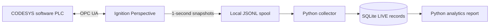
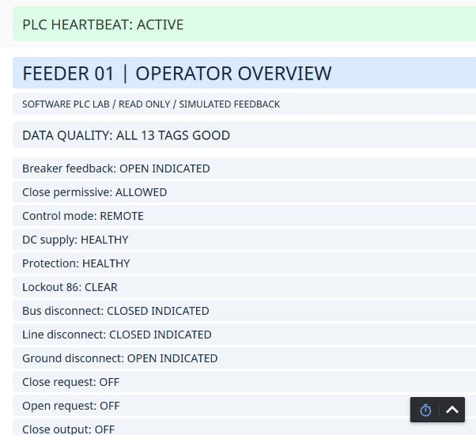
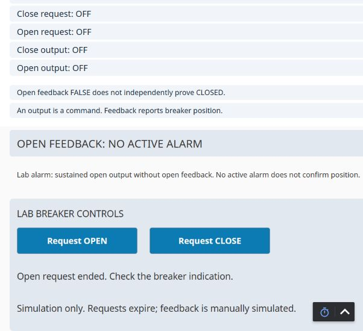
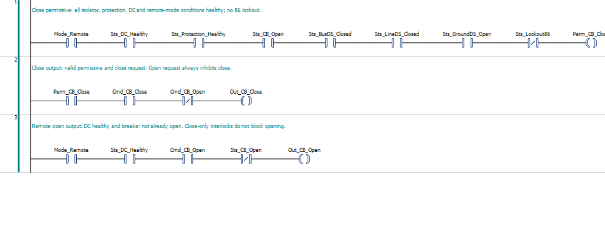
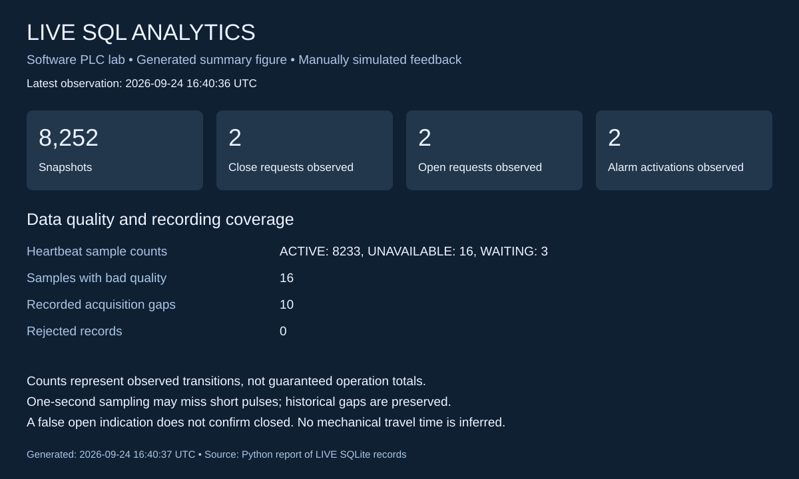

# Substation feeder automation lab

CODESYS ladder logic, Ignition Perspective HMI, OPC UA monitoring, and Python /
SQLite event analytics for a **software-only breaker-control demonstration**.
Breaker position feedback is manually simulated; no physical equipment is connected.



Start with [reproduction instructions](docs/SETUP.md). PLC source is distributed
as an editable PLCopen XML export, and the HMI as JSON view/component definitions.

## Screenshots and analytics preview

### Ignition operator overview

Live heartbeat, signal quality, permissives, and manually simulated breaker status.
The captured deployed screen retains its original “READ ONLY” subtitle; the
status rows are read-only, while the command panel below issues authenticated requests.



### HMI command controls

Open/Close request buttons and the missing-feedback alarm display, captured with
both commands and outputs off after live acceptance testing.



### CODESYS ladder logic

CODESYS ladder logic showing the close permissive and the close and open command rungs.



### Live SQL analytics

This is a **generated summary figure**, not a browser screenshot. Values come
from the same LIVE SQLite report used by the analytics tools; they are a static
snapshot, not a live feed. Historical bad-quality observations and gaps remain visible.



Regenerate with `python analytics/live_report.py` followed by
`python analytics/export_summary_svg.py`.

## Components

- PLC: close permissives, open priority, mutually exclusive command outputs,
  heartbeat counter, and a seven-second command duration guard.
- Ignition: 13 PLC Boolean tags, execution heartbeat, open-feedback alarm, and
  Perspective Open/Close request buttons with a signed-in-session check.
- Data: Gateway snapshots → JSONL spool → Python collector → SQLite LIVE database.
- Analytics: observed command/output transitions, alarm activations, heartbeat /
  quality counts, acquisition gaps, and recent SQL event history.
- Separate simulated-data fixture for repeatable response-classification tests.

## Current validation

PLC control project compiled with zero errors and warnings and was deployed to
the local software runtime. A CODESYS close request and its output cleared
automatically; LIVE SQL observed rising/falling edges 7.004 seconds apart.
This is sampled evidence of the guard, not precision timing. Both requests and
outputs were off afterward.

HMI buttons are deployed and signed-in Open/Close requests were verified through
the PLC and LIVE SQL records. Close cleared after 6.014 seconds and Open after
6.003 seconds between sampled observations. Lockout blocked Close without a new
command transition. Missing-open-feedback alarm activation and clearing were
recorded. An unauthenticated browser session was correctly blocked.

The live SQL report runs against real lab observations, with historical gaps
preserved. Automated checks: 18 analytics tests and 13 Ignition script tests.

## Run Python tools

Python 3.10+; standard library only. Continuous collector locking uses Windows.

```powershell
python analytics/feeder_lab.py demo
python analytics/live_logger.py --help
python analytics/live_status.py
python analytics/live_report.py
python -m unittest discover -s analytics -p 'test_*.py' -v
python -m unittest discover -s ignition -p 'test_*.py' -v
```

The live report is `analytics/output/live-report.html`. Regenerate it to refresh.
See [live logging setup](analytics/LIVE.md), [simulation analytics](analytics/README.md),
and [HMI control setup and acceptance](docs/HMI-controls.md).

## Scope and limitations

The PLC always evaluates its interlocks. An output requests motion; feedback
reports position. A false open indication does not independently confirm closed.
Requests are bounded level commands, not physical breaker coil specifications.
The seven-second guard does not provide anti-pumping or protection against an
external writer repeatedly reasserting a request.

One-second data acquisition can miss short pulses and is not an atomic PLC scan.
Live reports count observed transitions and do not claim mechanical travel time.
Trial expiry, runtime stops, and collector shutdowns can interrupt acquisition.
The collector is not a Windows service and does not automatically restart.
Seeq, physical I/O, dual position feedback, and commissioned protection are outside
this implementation. Local databases, credentials, caches and telemetry are excluded
from source control.
